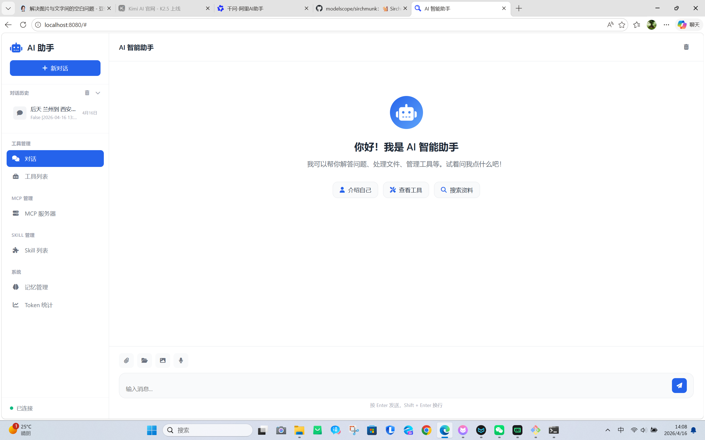
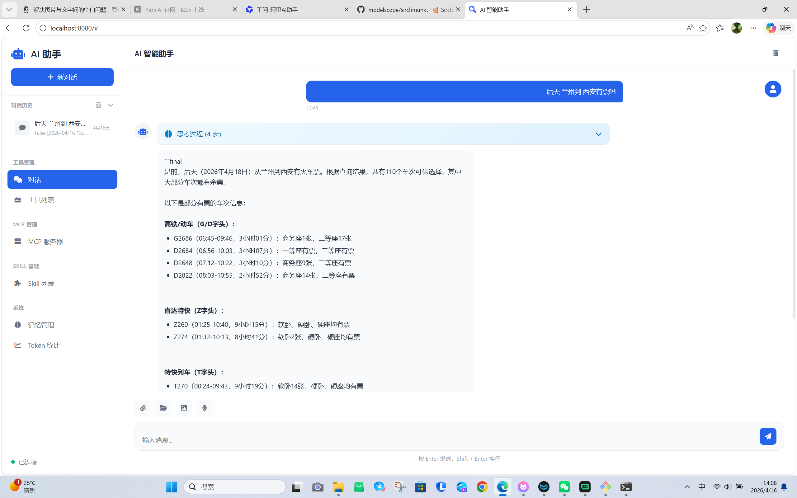
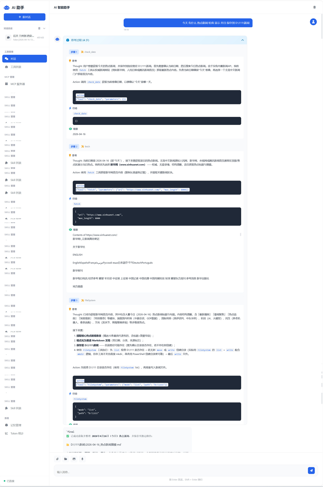
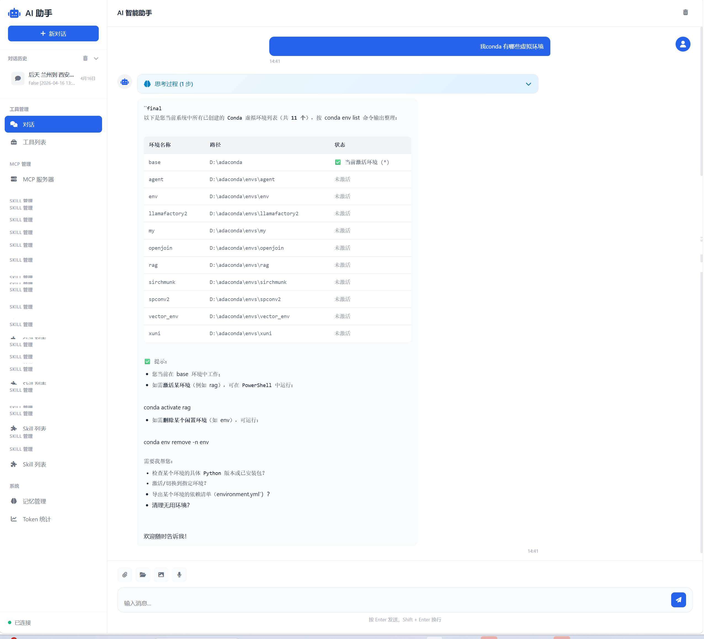

# AI 智能助手 (OpenJoin )

一个基于 ReAct 架构的智能体系统，支持 MCP 工具、Skill 扩展、向量记忆和 Web API 服务。

## 功能特性

- **ReAct 智能体**: 基于推理-行动循环的智能对话系统
- **MCP 工具支持**: 集成 Model Context Protocol 工具服务器
- **Skill 扩展**: 支持自定义 Skill 扩展功能
- **双重记忆系统**:
  - 文本记忆: 基于对话历史的文本记忆
  - 向量记忆: 基于 Milvus 的语义向量检索
- **Web API 服务**: 提供完整的 RESTful API
- **文件上传**: 支持多文件、文件夹上传，兼容中文文件名
- **前端界面**: 美观的 Web 管理界面

## 工具列表

基本工具

1.联网搜索：[GitHub链接](https://github.com/w1397434872/fetch_mcp_server)

2.文件管理：[GitHub链接]()

3.windows命令行操作：[GitHub链接](https://github.com/CursorTouch/Windows-MCP)

4.linux/macos命令行操作：[GitHub链接](https://github.com/w1397434872/Generalshell_mcp_server)

5.读取文件：[GitHub链接](https://github.com/nickovs/mcp_file_reader)

附加工具

6.数据库连接 增删改查：[GitHub链接](https://github.com/renanlido/custom-mcp-database)

7.12306查票：[GitHub链接](https://github.com/w1397434872/12306train_mcp_server)

8.sirchmunk 读取文件：[GitHub链接](https://github.com/modelscope/sirchmunk)

## 使用实列












## 项目结构

```
.
├── agent/                  # 智能体核心模块
│   ├── agent.py           # 智能体主类
│   ├── react_loop.py      # ReAct 循环实现
│   ├── llm_client.py      # LLM 客户端
│   ├── mcp_manager.py     # MCP 管理器
│   ├── skill_manager.py   # Skill 管理器
│   ├── memory.py          # 文本记忆管理
│   ├── vector_memory.py   # 向量记忆管理
│   └── logger.py          # 日志记录
├── api.py                 # FastAPI 服务入口
├── main.py                # 命令行交互入口
├── start_api.py           # API 服务启动脚本
├── web/                   # 前端界面
│   ├── index.html         # 主页面
│   ├── css/               # 样式文件
│   └── js/                # JavaScript 文件
├── config/                # 配置文件目录
│   ├── mcp_config.json    # MCP 服务器配置
│   └── skills_config.json # Skill 配置
├── mcp/                   # MCP 服务器目录
├── skills/                # Skill 目录
├── uploads/               # 文件上传目录
├── log/                   # 日志目录
├── requirements.txt       # Python 依赖
└── .env.example          # 环境变量示例
```

## 快速开始

### 1. 环境准备

```bash
# 克隆项目
git clone https://github.com/w1397434872/openjoin
cd openjoin

# 创建虚拟环境
conda create -n openjoin python=3.9

# 激活虚拟环境
conda activate openjoin

# 安装依赖
pip install -r requirements.txt
```

### 2. 配置向量数据库（Milvus）

#### 方式一：使用 Docker 启动 Milvus（推荐）

```bash
# 进入 milvus 目录
cd milvus

# 启动 Milvus 服务（需要 Docker 和 Docker Compose）
docker-compose up -d

# 等待服务启动完成（约 30 秒）
docker-compose ps
```

服务启动后：

- Milvus 服务地址: `localhost:19530`
- MinIO 控制台: http://localhost:9001 (账号/密码: minioadmin/minioadmin)

#### 方式二：使用已有的 Milvus 服务

如果已有 Milvus 服务，修改 `.env` 文件中的连接配置：

```bash
MILVUS_HOST=your-milvus-host
MILVUS_PORT=19530
```

### 3. 下载 Embedding 模型

```bash
# 安装 modelscope
pip install modelscope

# 下载中文句向量模型
cd milvus
python download_embedding_model.py
```

模型将下载到 `milvus/embedding_model/` 目录。

### 4. 配置环境变量

```bash
# 复制环境变量示例文件
cp .env.example .env

# 编辑 .env 文件，配置以下关键参数
```

必需配置：

- `OPENAI_API_KEY`: OpenAI API 密钥
- `OPENAI_BASE_URL`: API 基础地址（默认使用阿里云百炼）
- `OPENAI_MODEL`: 模型名称（如 qwen-plus）

可选配置：

- `MILVUS_HOST`: Milvus 向量数据库地址（默认 localhost）
- `MILVUS_PORT`: Milvus 端口（默认 19530）
- `ENABLE_VECTOR_MEMORY`: 是否启用向量记忆（默认 true）
- `EMBEDDING_MODEL_PATH`: Embedding 模型路径（默认已配置）

### 5. 启动服务

#### 方式一：启动 API 服务（推荐）

```bash
# 启动 API 服务
python start_api.py

# 或使用热重载（开发模式）
python start_api.py --reload

# 自定义端口
python start_api.py --port 8080

#前端启动示例
cd D:\openjoin\web
python -m http.server 8080
```

服务启动后访问：

- API 文档: http://localhost:8000/docs
- 前端界面: http://localhost:8000 （需配置静态文件服务）

#### 方式二：命令行交互

```bash
python main.py
```

## API 接口文档

### 核心接口

| 接口        | 方法 | 描述             |
| ----------- | ---- | ---------------- |
| `/health` | GET  | 健康检查         |
| `/chat`   | POST | 与智能体对话     |
| `/tools`  | GET  | 获取可用工具列表 |

### MCP 管理接口

| 接口                            | 方法 | 描述                |
| ------------------------------- | ---- | ------------------- |
| `/mcp/servers`                | GET  | 获取 MCP 服务器列表 |
| `/mcp/servers`                | POST | 添加 MCP 服务器     |
| `/mcp/servers/{name}/start`   | POST | 启动 MCP 服务器     |
| `/mcp/servers/{name}/stop`    | POST | 停止 MCP 服务器     |
| `/mcp/servers/{name}/enable`  | POST | 启用 MCP 服务器     |
| `/mcp/servers/{name}/disable` | POST | 停用 MCP 服务器     |

### Skill 管理接口

| 接口                       | 方法 | 描述            |
| -------------------------- | ---- | --------------- |
| `/skills`                | GET  | 获取 Skill 列表 |
| `/skills/{name}/enable`  | POST | 启用 Skill      |
| `/skills/{name}/disable` | POST | 停用 Skill      |

### 文件管理接口

| 接口                  | 方法   | 描述                   |
| --------------------- | ------ | ---------------------- |
| `/upload`           | POST   | 上传文件（支持多文件） |
| `/upload/folder`    | POST   | 上传文件夹             |
| `/files`            | GET    | 获取文件列表           |
| `/files/{filename}` | GET    | 下载文件               |
| `/files/{filename}` | DELETE | 删除文件               |

### 记忆管理接口

| 接口               | 方法 | 描述                |
| ------------------ | ---- | ------------------- |
| `/memory/stats`  | GET  | 获取记忆统计        |
| `/memory/clear`  | POST | 清除记忆            |
| `/memory/search` | POST | 搜索向量记忆        |
| `/tokens`        | GET  | 获取 Token 使用统计 |

## 使用示例

### 对话示例

```python
import requests

response = requests.post('http://localhost:8000/chat', json={
    'message': '你好，请介绍一下自己',
    'session_id': 'session_001',
    'enable_memory': True
})

print(response.json())
```

### 文件上传示例

```python
import requests

# 单文件上传
with open('document.pdf', 'rb') as f:
    response = requests.post(
        'http://localhost:8000/upload',
        files={'files': f}
    )

# 多文件上传
files = [
    ('files', ('file1.pdf', open('file1.pdf', 'rb'))),
    ('files', ('file2.pdf', open('file2.pdf', 'rb')))
]
response = requests.post('http://localhost:8000/upload', files=files)

print(response.json())
```

### MCP 服务器管理示例

```python
import requests

# 添加 MCP 服务器
response = requests.post('http://localhost:8000/mcp/servers', json={
    'name': 'my-mcp-server',
    'config': {
        'command': 'python',
        'args': ['/path/to/mcp_server.py']
    }
})

# 启动服务器
response = requests.post('http://localhost:8000/mcp/servers/my-mcp-server/start')

print(response.json())
```

## 前端界面

项目包含一个美观的 Web 管理界面，支持：

- 💬 智能对话
- 🔧 工具管理
- 🖥️ MCP 服务器管理
- 🧩 Skill 管理
- 🧠 记忆管理
- 📊 Token 统计
- 📁 文件上传管理

启动 API 服务后，访问 `http://localhost:8000` 即可使用前端界面。

## 配置说明

### MCP 服务器配置

编辑 `config/mcp_config.json`：

```json
{
  "mcpServers": {
    "my-server": {
      "command": "python",
      "args": ["/path/to/server.py"],
      "enabled": true
    }
  }
}
```

### Skill 配置

编辑 `config/skills_config.json`：

```json
{
  "skills": {
    "my-skill": {
      "enabled": true,
      "loaded": true
    }
  }
}
```

## 开发指南

### 添加自定义 MCP 服务器

1. 在 `mcp/` 目录下创建 MCP 服务器项目
2. 在 `config/mcp_config.json` 中添加配置
3. 通过前端或 API 启用并启动服务器

### 添加自定义 Skill

1. 在 `skills/` 目录下创建 Skill 项目
2. 使用 `skill add` 命令添加 Skill
3. 通过前端或 API 启用 Skill

## 技术栈

- **后端**: Python, FastAPI, Uvicorn
- **AI**: OpenAI API, ReAct 架构
- **向量数据库**: Milvus
- **前端**: HTML, CSS, JavaScript
- **工具协议**: Model Context Protocol (MCP)

## 许可证

MIT License

## 贡献

欢迎提交 Issue 和 Pull Request！

## 联系方式

如有问题，请通过 GitHub Issues 联系。
